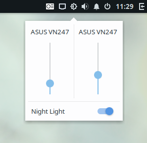

# Budgie Monitor Brightness Applet

Control your monitors brightness using the DDC/CI protocol.


---



---

## Dependencies

```
gtk+-3.0 >= 3.18
budgie-1.0 >= 2
glib-2.0 >= 2.46.0
libpeas-1.0 >= 1.8.0
ddcutil >= 0.9.0
```

These can be installed on Solus by running:

```bash
sudo eopkg it -c system.devel
sudo eopkg it budgie-desktop-devel ddcutil-devel
```

## Configuration on Solus

Before you are able use budgie-monitor-brightness-applet, you have to configure [ddcutil](https://www.ddcutil.com/) and check, if your hardware is capable of DDC/CI:

The i2c_dev module has to be active:

```bash
sudo modprobe i2c_dev
```

Test, if your monitor is capable of DDC/CI (you may have to enable a feature called DDC/CI in your monitor OSD settings):

```bash
sudo ddcutil detect
```

Here an overview of your connected monitors has to be shown, otherwise the budgie-monitor-brightness-applet won't work.
If you are using a Nvidia graphics card and the output gives you error messages like "Invalid display" and "DDC communication failed" for your monitor, you may need another [workaround](https://www.ddcutil.com/nvidia/).

Next step is to add a group that gains permissions to access the I²C interfaces and add your user to that group:

```bash
sudo groupadd --system i2c
sudo usermod $USER -aG i2c
```

Ddcutil comes with an udev rule that gives the group i2c permissions to the i2c interfaces. This one has to be copied to /etc/udev/rules.d

```bash
sudo cp /usr/share/ddcutil/data/45-ddcutils-i2c.rules /etc/udev/rules.d
```

Finaly the module **i2c_dev** has to be loaded on every startup:

```bash
sudo sh -c "echo i2c_dev > /etc/modules-load.d/i2c-dev.conf"
```

## Building and Installation

```bash
meson --prefix /usr --buildtype=plain build
cd build
ninja
sudo ninja install
```

## TODO

- [x] support external monitors

- [x] support internal displays

- [x] add translations

- [ ] detect connect and disconnect of external monitors
